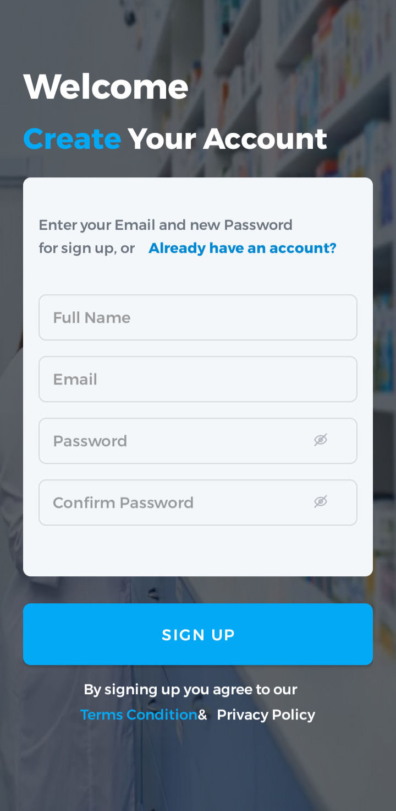

# Pharmacy Merchant Sample Ecommerce App

## Description

As per request, I have built this sample app to demonstrate my code. 
The app currently consumes API from https://us-central1-strategycorp-sample.cloudfunctions.net/app/api/. There are two (2) GET request done for products and categories respectively. The products and categories are retrieved from aforementioned API then stored locally using RoomDb. 

This Application was built with Kotlin and includes:
1. Retrofit
2. Room Database
3. MVVM Architecture
4. ViewModel
5. LiveData
6. Dagger-Hilt
7. Navigation Component
8. ViewBinding
9. JetPack Navigation
10. Corourines
11. Coil
12. DataStore - To be implemented

I intended to use datastore for the purpose of persisting user data but I have to leave out for a few hours and as such I am not sure if i'll be able to get it done in time. If I am able to I will make another commit. Also if you have any request for feature implementation, for the purpose of skill demonstration, I can include it as well.

App Screens:

     &nbsp;&nbsp;&nbsp;  
    

     

     &nbsp;&nbsp;&nbsp;  
    

     

     &nbsp;&nbsp;&nbsp;  
    

     

     &nbsp;&nbsp;&nbsp;  
    

     

     &nbsp;&nbsp;&nbsp;
    

     

